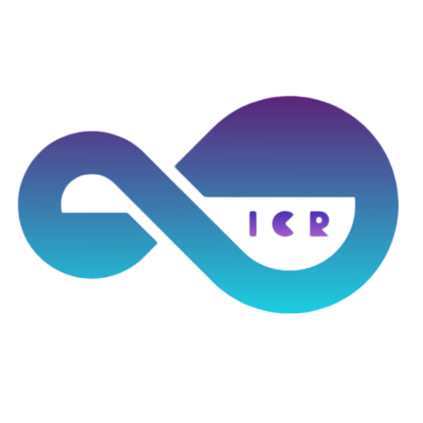
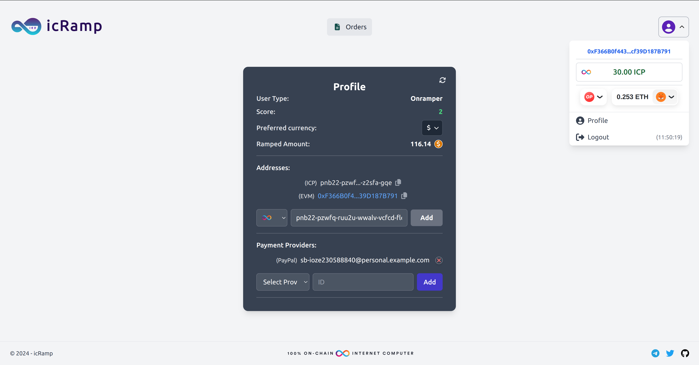
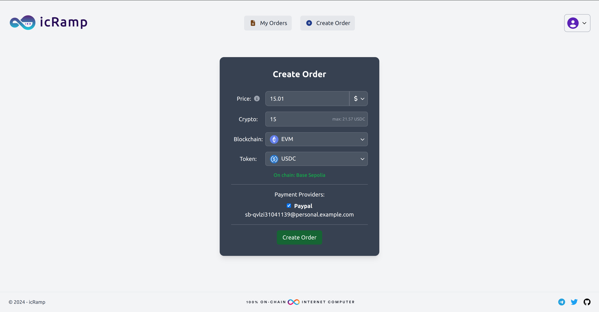
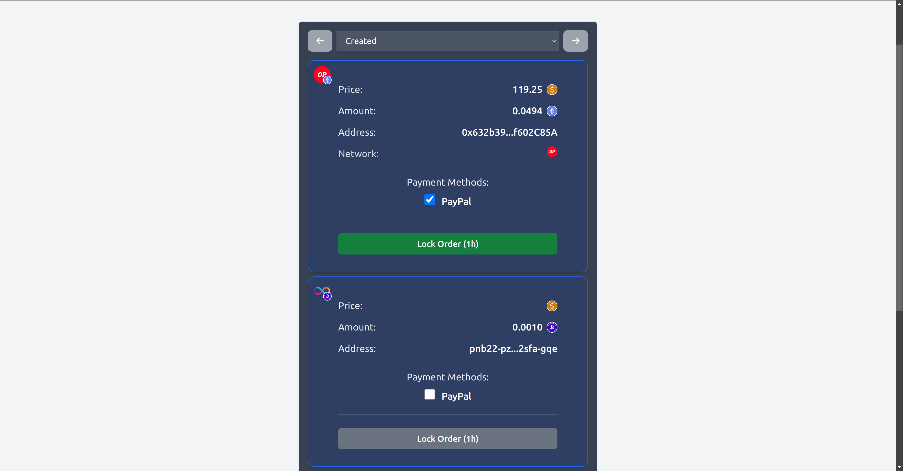
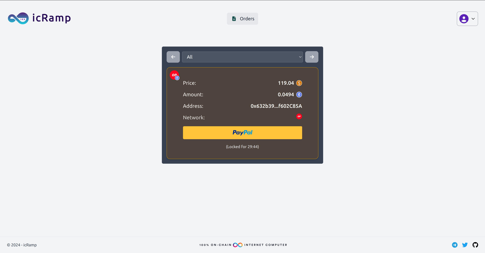
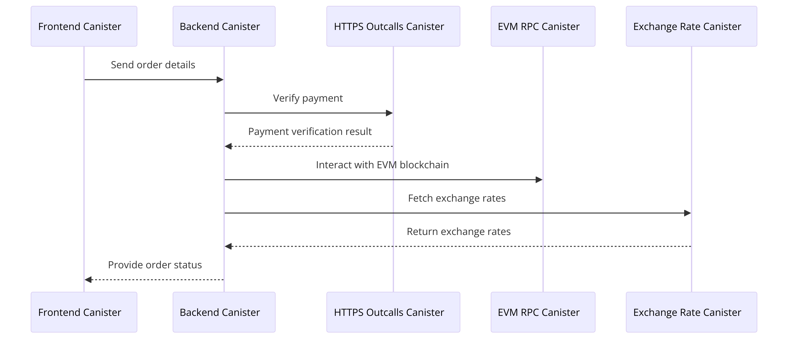
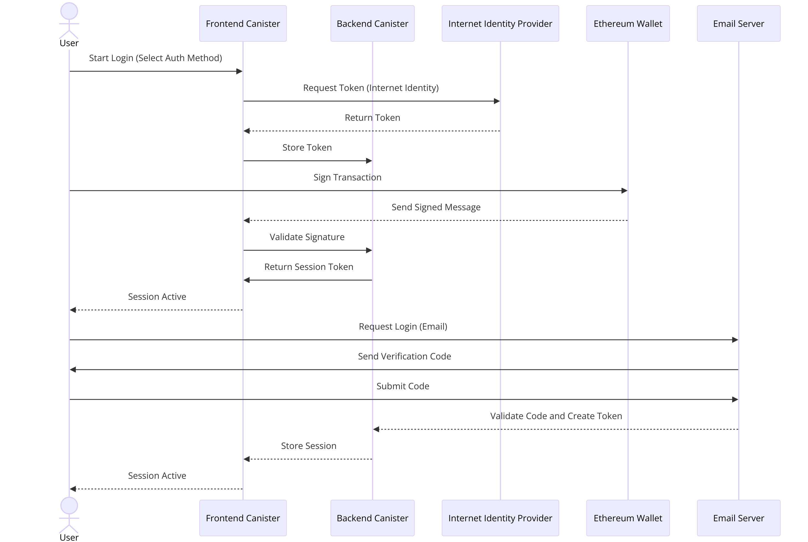
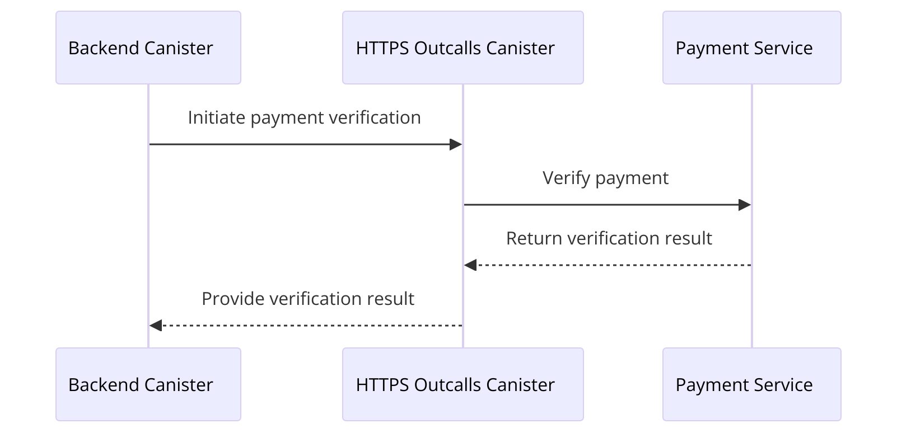
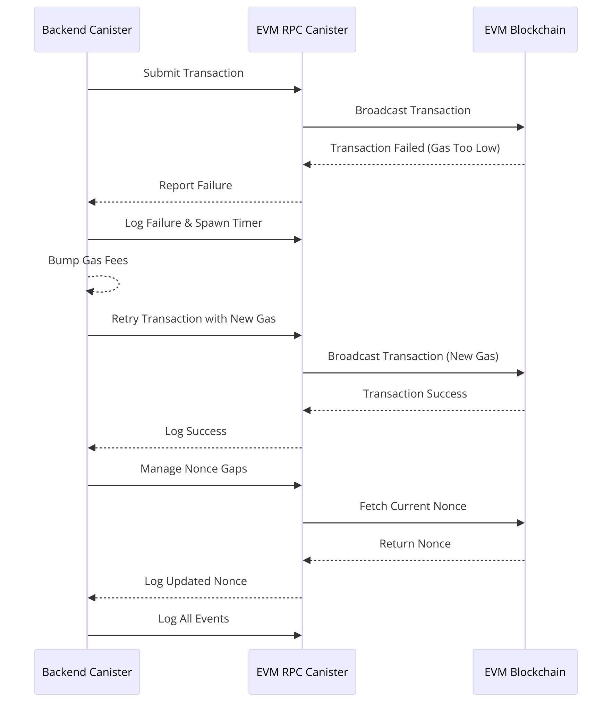
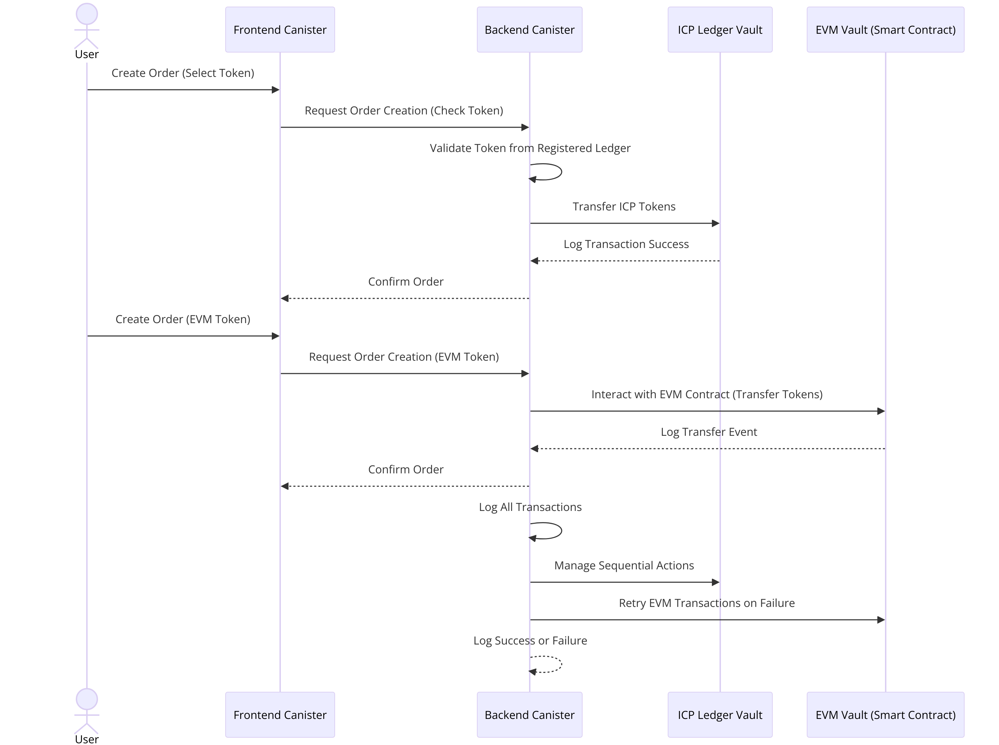

<p align="center">

</p>

# icRamp

<div id="badges">
  <a href="https://x.com/ic_rampXYZ?t=kjzM0v-CJiSfGR_RC8qSCg&s=09" target="_blank">
    
  </a>
  &nbsp;&nbsp;
  <a href="https://t.me/+1qd_xreS_hpkMTBk" target="_blank">
    
  </a>
  &nbsp;&nbsp;
  <a href="https://mesquite-structure-f75.notion.site/Onboarding-114aa21f9dd480ffb6a0ed741dddc80c" target="_blank">
    
  </a>
</div>

#

**icRamp** is a decentralized protocol combining the Internet Computer (ICP) with Ethereum and other EVM blockchains to facilitate onramping and offramping of digital assets. This protocol simplifies onramping and offramping digital assets with a secure, user-friendly platform, eliminating the need for centralized exchanges and reducing trust issues.

Created for [ETH Prague 2024](https://devfolio.co/projects/icpramp-ca30), this project leverages multiple ICP canisters for enhanced functionality, including HTTPS outcalls, EVM RPC communication, and real-time exchange rate retrieval. For the associated EVM smart contracts used in the frontend and backend canisters, visit the [icRamp-contracts](https://github.com/reymom/ic2P2ramp-contracts) repository.

## Use Cases

### Onramping Fiat to Crypto

Users can convert their fiat currency (e.g., USD) into cryptocurrency directly from their bank accounts or payment processors like PayPal. This process involves verifying the payment and then executing a transaction on an EVM blockchain (e.g., Ethereum, MANTLE) to provide the user with the equivalent amount of cryptocurrency.

### Offramping Crypto to Fiat

Users can convert their cryptocurrency back into fiat currency. This involves locking the crypto in an escrow smart contract and verifying the equivalent fiat payment via payment processors. Once verified, the crypto is released to the onramper.

### Secure Cross-Chain Transactions

The protocol supports secure transactions across multiple EVM blockchains. This includes utilizing secure HTTPS outcalls for fetching external data, real-time exchange rate retrieval for accurate conversions, and EVM RPC for executing transactions on various blockchains.

### Real-Time Exchange Rate Retrieval

Using the Exchange Rate Canister, IC2P2Ramp provides users with real-time exchange rates for various cryptocurrencies. This ensures users get the best market rates for their transactions, enhancing the efficiency and transparency of the protocol.

## Screenshots

### Login Page

<p align="center">

</p>

### Profile Page

<p align="center">

</p>

### Create Order

<p align="center">

</p>

### View and Lock Orders

<p align="center">

</p>

### Pay Order

<p align="center">

</p>

## Canisters and components

<p align="center" style="margin-top:25px">

</p>

### Authentication and Login

icRamp supports login and authentication with email, Internet Identity and Ethereum Walets such as Metamask.

<p align="center" style="margin-top:25px">

</p>

### HTTPS Outcalls Canister

The HTTPS Outcalls Canister enables secure HTTPS requests from ICP canisters, allowing for external data fetching and API interactions. It is used particularly to fetch order details from the Paypal API in order to verify the transactions.

<p align="center" style="margin-top:25px">

</p>

### EVM RPC Canister

The EVM RPC Canister is a smart contract on the ICP that communicates with Ethereum and other EVM blockchains. It provides an on-chain API for interacting with smart contracts and retrieving blockchain data. It is used to release the funds once the paypal payment is verified.

<p align="center" style="margin-top:25px">

</p>

### Exchange Rate Canister

The Exchange Rate Canister retrieves and provides exchange rates for various assets. It uses an external API to fetch real-time exchange rates and serves this data to other canisters within the protocol. It is used to automatically fetch the best market price for the offramper order.

### Backend Canister

The Backend Canister handles the core business logic of the icRamp protocol. It manages orders, communicates with the EVM RPC canister for blockchain interactions with the escrow in different EVM blockchains, such as Mantle and Polygon, and verifies paypal payments using the HTTPS Outcalls canister.

### Frontend Canister

The Frontend Canister provides a user-friendly interface for interacting with the icRamp protocol. Users can create and manage orders, view exchange rates, make payments and perform other related onramping and offramping operations.

<p align="center" style="margin-top:25px">

</p>

## 🛠️ Usage

### Build

To build the canisters, use the following command:

```shell
dfx build
```

## Interact

- Call the `get_usd_exchange_rate` method to retrieve the exchange rate for a given asset:

```shell
dfx canister call backend get_usd_exchange_rate '( "ETH" )'
```

- Retrieve and verify a paypal order using the backend canister:

```sh
dfx canister call backend verify_transaction '( "0", transaction_id = "4UC03319AV493141A" )'
```

### Locally:

Run the following commands in a new, empty project directory:

```sh
git clone https://github.com/reymom/ic2P2ramp.git
cd ic2P2ramp
dfx start --clean --background
npm install
npm run setup # Install packages, deploy canisters, and generate type bindings

npm start # Start the development server
```

Also, to deploy seamlessly with prepopulated init arguments:

```sh
./scripts/deploy_local.sh
```

And for updates, check different argument options in:

```sh
./scripts/update.sh
```

## 📚 Documentation

- [Internet Computer docs](https://internetcomputer.org/docs/current/developer-docs/ic-overview)
- [Internet Computer wiki](https://wiki.internetcomputer.org/)
- [Internet Computer forum](https://forum.dfinity.org/)
- [Vite developer docs](https://vitejs.dev/guide/)
- [React quick start guide](https://react.dev/learn)
- [`dfx.json` reference schema](https://internetcomputer.org/docs/current/references/dfx-json-reference/)
- [Rust developer docs](https://internetcomputer.org/docs/current/developer-docs/backend/rust/)
- [EVM RPC developer docs](https://internetcomputer.org/docs/current/developer-docs/integrations/ethereum/evm-rpc/)
- [Developer Experience Feedback Board](https://dx.internetcomputer.org/)

## License

This project is licensed under the MIT license, see LICENSE.md for details. See CONTRIBUTE.md for details about how to contribute to this project.
