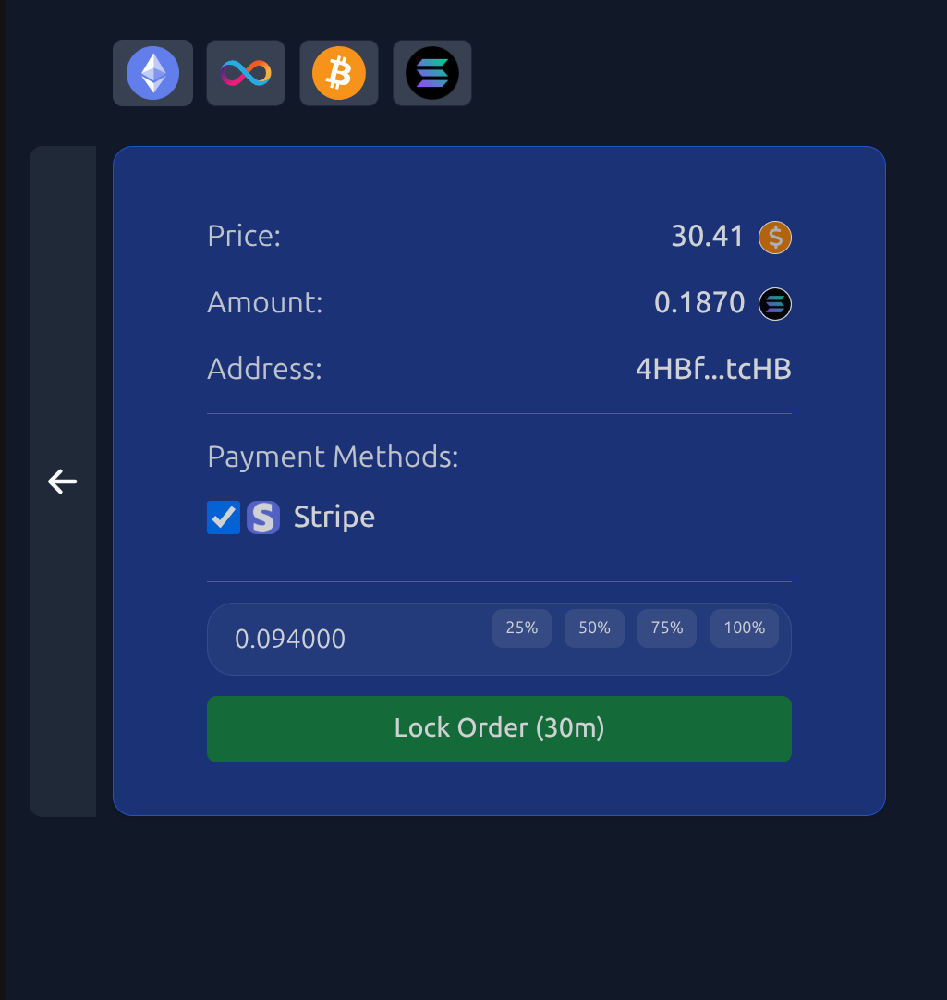
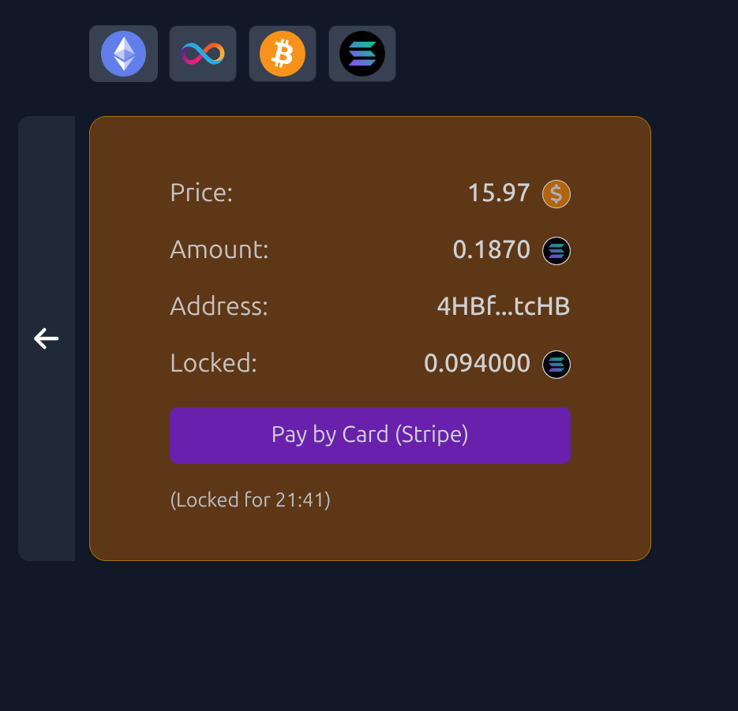
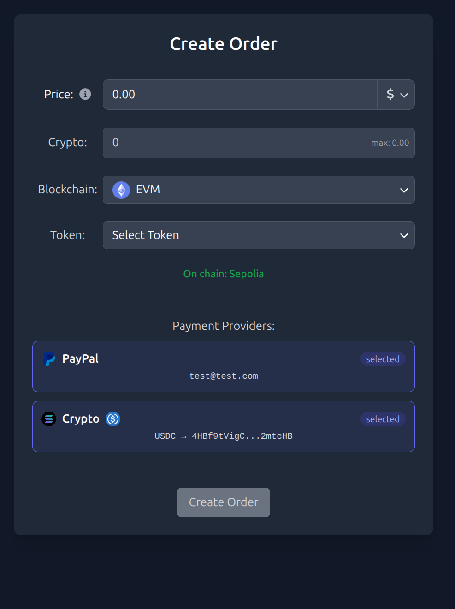

<p align="center">

</p>

# icRamp

<div id="badges">
  <a href="https://x.com/ic_rampXYZ?t=kjzM0v-CJiSfGR_RC8qSCg&s=09" target="_blank">
    
  </a>
  <a href="https://t.me/+1qd_xreS_hpkMTBk" target="_blank">
    
  </a>
  <a href="https://mesquite-structure-f75.notion.site/Onboarding-114aa21f9dd480ffb6a0ed741dddc80c" target="_blank">
    
  </a>
</div>

#

**icRamp** is a fully trustless P2P on/off-ramp that works across **Bitcoin, Ethereum, Solana, and the Internet Computer**, allowing people worldwide to exchange **fiat ↔ crypto** securely and without custodians.

It leverages the Internet Computer’s unique capabilities:

- **HTTPS Outcalls** → verify PayPal + Stripe payments trustlessly
- **ic-alloy EVM RPC** → query EVM smart contracts directly from canisters
- **Deterministic Rust canisters** → orchestrate cross-chain vault logic
- **Threshold ECDSA** → manage Bitcoin transactions
- **Canister-based Solana RPC** → sign transactions and verify SPL transfers

Built through 3 ICP Grants (EVM, Bitcoin, Solana + Payment Layer Overhaul).

## Key Features

### 🔗 **Multi-Chain Wallet → Wallet Settlement**

- BTC (UTXO)
- ETH & EVM chains (ERC-20)
- Solana (SPL tokens)
- ICP (ICRC-1)

### 🧾 **Fiat Payments (Trustlessly Verified)**

- PayPal
- Revolut
- Stripe Connect (destination charges, per-order success/cancel URLs)
- Email provider (credit card for stripe's counterparty)

### 💧 **Liquid Orders (Milestone 2)**

- **Partial Fills**: onramper locks only part of the order
- **Top-Ups**: offramper adds more liquidity on demand
- Aggregate fills tracked over time
- Unified release logic across all chains

<div align="center">
  
  <p><em>Onramper committing a partial fill</em></p>

  
  <p><em>Stripe Checkout for a partial fill</em></p>
</div>

# 💰 **Pay-With-Crypto (Wallet↔Wallet Trustless Flow)**

Users can settle orders using on-chain payment instead of Stripe/PayPal:

- BTC → BTC
- ETH → ERC20
- SOL → SPL token
- ICP → ICRC-1

Backend listeners verify chain-specific transactions and release funds accordingly.

<div align="center">
  
  <p><em>Offramper creating a Solana USDC order</em></p>
</div>

## 🧱 Architecture (High Level)

┌─────────────────────┐
│ Frontend (React) │
└──────────┬──────────┘
│
▼
┌───────────────────┐ ┌──────────────────┐
│ icramp_backend │◀──▶│ HTTPS Outcalls │
│ (Rust canister) │ │ (PayPal, Stripe) │
├───────────────────┤ └──────────────────┘
│ Orders / Fills │
│ Payment Providers │
│ Multi-Chain Vault │
└──────────┬────────┘
│
▼
┌───────────────────────────────────┐
│ On-Chain Listeners │
├───────────────────────────────────┤
│ BTC → BTC RPC + T-ECDSA │
│ EVM → ic-alloy + RPC EVM Canister │
│ Solana → SPL transfer parser │
│ ICP → ICRC-1 ledger queries │
└───────────────────────────────────┘

## 🪙 Stripe, Revolut, PayPal

- Stripe Connect onboarding flow
- Redirect-survival logic
- Verified via HTTPS Outcalls
- Stored per-user provider
- Used for **partial fills** + **top-ups**

## ⚡ EVM Vault (icRamp v2)

- Minimal Solidity vault contract
- Only `deposit / withdraw / release`
- Business logic moved to ICP
- `getDeposit` called via **ic-alloy**: ABI-free, typesafe, cheap

## Old Screenshots

### Login Page

<p align="center">

</p>

### Profile Page

<p align="center">

</p>

### Create EVM Order

<p align="center">

</p>

### Create Bitcoin Order

<p align="center">

</p>

### View and Lock Orders

<p align="center">

</p>

### Pay Order

<p align="center">

</p>

## Canisters and components

<p align="center" style="margin-top:25px">

</p>

### Authentication and Login

icRamp supports login and authentication with email, Internet Identity and Ethereum Walets such as Metamask.

<p align="center" style="margin-top:25px">

</p>

### HTTPS Outcalls Canister

The HTTPS Outcalls Canister enables secure HTTPS requests from ICP canisters, allowing for external data fetching and API interactions. It is used particularly to fetch order details from the Paypal API in order to verify the transactions.

<p align="center" style="margin-top:25px">

</p>

### EVM RPC Canister

The EVM RPC Canister is a smart contract on the ICP that communicates with Ethereum and other EVM blockchains. It provides an on-chain API for interacting with smart contracts and retrieving blockchain data. It is used to release the funds once the paypal payment is verified.

<p align="center" style="margin-top:25px">

</p>

### Exchange Rate Canister

The Exchange Rate Canister retrieves and provides exchange rates for various assets. It uses an external API to fetch real-time exchange rates and serves this data to other canisters within the protocol. It is used to automatically fetch the best market price for the offramper order.

### Backend Canister

The Backend Canister handles the core business logic of the icRamp protocol. It manages orders, communicates with the EVM RPC canister for blockchain interactions with the escrow in different EVM blockchains, such as Mantle and Polygon, and verifies paypal payments using the HTTPS Outcalls canister.

### Frontend Canister

The Frontend Canister provides a user-friendly interface for interacting with the icRamp protocol. Users can create and manage orders, view exchange rates, make payments and perform other related onramping and offramping operations.

<p align="center" style="margin-top:25px">

</p>

## How icRamp Supports ICP Adoption

- Multi-Chain Interoperability: Bridges Bitcoin, Ethereum, and ICP.

- Open-Source SDKs & Modules: Provides reusable smart contracts and APIs.

- Educational Content: Blogs, tutorials, and documentation to onboard developers.

## Community Engagement & Future Plans

- Open-source contributions to encourage adoption.

- Workshops and hackathons to showcase icRamp.

- Expanding to Solana and additional fiat onramping solutions.

## 🛠️ Usage

### Build

To build the canisters, use the following command:

```shell
dfx build
```

## Interact

- Call the `get_usd_exchange_rate` method to retrieve the exchange rate for a given asset:

```shell
dfx canister call backend get_usd_exchange_rate '( "ETH" )'
```

- Retrieve and verify a paypal order using the backend canister:

```sh
dfx canister call backend verify_transaction '( "0", transaction_id = "4UC03319AV493141A" )'
```

### Locally:

Run the following commands in a new, empty project directory:

```sh
git clone https://github.com/reymom/ic2P2ramp.git
cd ic2P2ramp
dfx start --clean --background
npm install
npm run setup # Install packages, deploy canisters, and generate type bindings

npm start # Start the development server
```

Also, to deploy seamlessly with prepopulated init arguments:

```sh
./scripts/deploy/deploy_local.sh
```

And for updates, check different argument options in:

```sh
./scripts/update.sh
```

## 📚 Documentation

- [Internet Computer docs](https://internetcomputer.org/docs/current/developer-docs/ic-overview)
- [Internet Computer wiki](https://wiki.internetcomputer.org/)
- [Internet Computer forum](https://forum.dfinity.org/)
- [Vite developer docs](https://vitejs.dev/guide/)
- [React quick start guide](https://react.dev/learn)
- [`dfx.json` reference schema](https://internetcomputer.org/docs/current/references/dfx-json-reference/)
- [Rust developer docs](https://internetcomputer.org/docs/current/developer-docs/backend/rust/)
- [EVM RPC developer docs](https://internetcomputer.org/docs/current/developer-docs/integrations/ethereum/evm-rpc/)
- [Bitcoin developer docs](https://internetcomputer.org/docs/references/bitcoin-how-it-works)
- [Developer Experience Feedback Board](https://dx.internetcomputer.org/)

## License

This project is licensed under the MIT license, see LICENSE.md for details. See CONTRIBUTE.md for details about how to contribute to this project.
