<p align="center">
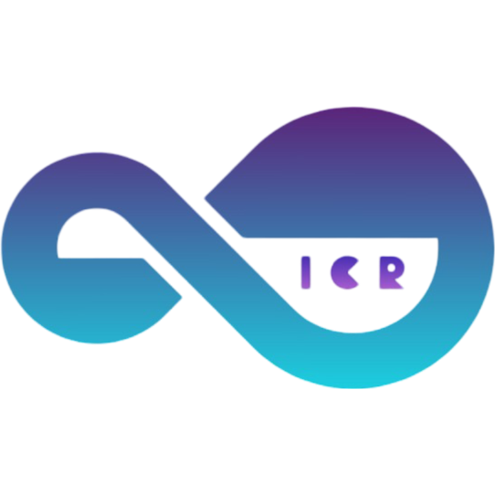
</p>

# icRamp

<div id="badges">
  <a href="https://x.com/ic_rampXYZ?t=kjzM0v-CJiSfGR_RC8qSCg&s=09" target="_blank">
    
  </a>
  <a href="https://t.me/+1qd_xreS_hpkMTBk" target="_blank">
    
  </a>
  <a href="https://mesquite-structure-f75.notion.site/Onboarding-114aa21f9dd480ffb6a0ed741dddc80c" target="_blank">
    
  </a>
</div>

#

**icRamp** is a decentralized P2P platform for fiat and cryptocurrency transactions across multiple blockchains, including Bitcoin, Ethereum, and Internet Computer (ICP). It eliminates reliance on centralized exchanges by enabling secure and seamless onramping and offramping solutions with built-in Bitcoin Runes and Ordinals support.

Initiated in [ETH Prague 2024](https://devfolio.co/projects/icpramp-ca30), this project leverages multiple ICP canisters for enhanced functionality, including HTTPS outcalls, EVM RPC communication, and real-time exchange rate retrieval. For the associated EVM smart contracts used in the frontend and backend canisters, visit the [icRamp-contracts](https://github.com/reymom/icRamp-contracts) repository. The platform now also enables seamless Bitcoin and Runes transactions through its integrated Bitcoin canister, added for [Devcon’s ICP Hackerhouse](https://github.com/ICP-Hacker-House/Devcon_BKK).

With this Bitcoin integration, users can now create Bitcoin-based orders alongside Ethereum and other EVM-based assets. The Bitcoin canister uses ICP’s threshold ECDSA signatures for secure transactions, allowing users to securely lock and unlock BTC funds without requiring an external wallet. To learn more about the EVM smart contracts that power these functionalities, visit the icRamp-contracts repository.

## Features

- P2P Onramping & Offramping: Users can trade fiat for crypto and vice versa in a decentralized manner.

- Bitcoin Runes Integration: Seamlessly lock, unlock, and manage balances with Runes.

- Multi-Chain NFT & Ordinals Marketplace: Trade Ethereum NFTs, Bitcoin Ordinals/Runes, and ICP NFTs.

- Decentralized Governance: Future DAO-based governance for decision-making.

- Multi-Wallet Authentication: Supports Internet Identity, Metamask, and Bitcoin wallets like Unisat.

- Real-time Exchange Rates: Integrates with external APIs for accurate pricing.

- Secure Bitcoin Canister Integration: Robust handling of transactions and storage.

## Screenshots

### Login Page

<p align="center">
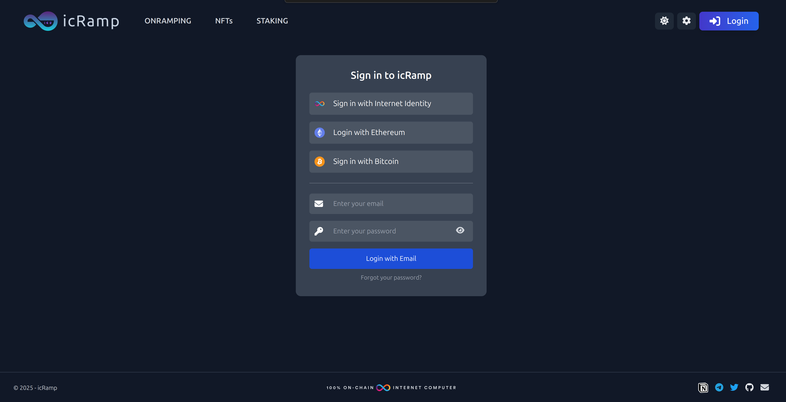
</p>

### Profile Page

<p align="center">
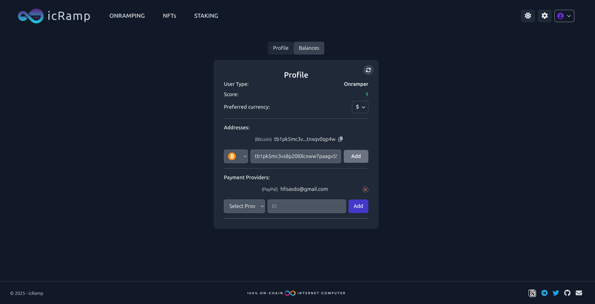
</p>

### Create EVM Order

<p align="center">
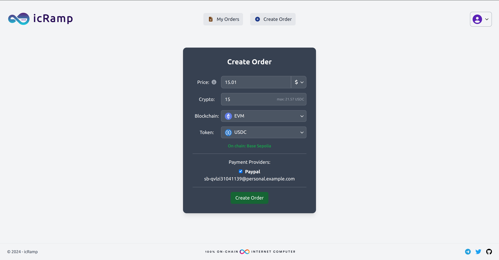
</p>

### Create Bitcoin Order

<p align="center">
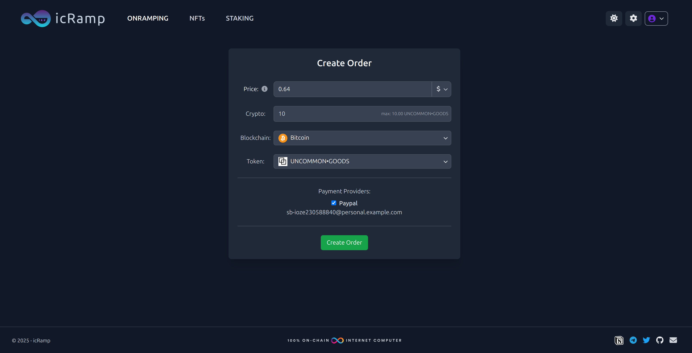
</p>

### View and Lock Orders

<p align="center">
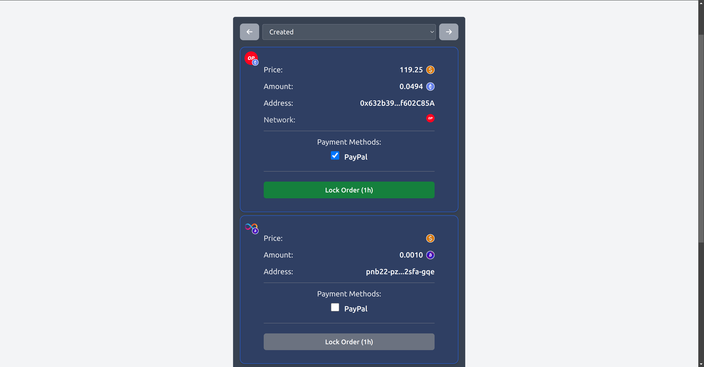
</p>

### Pay Order

<p align="center">
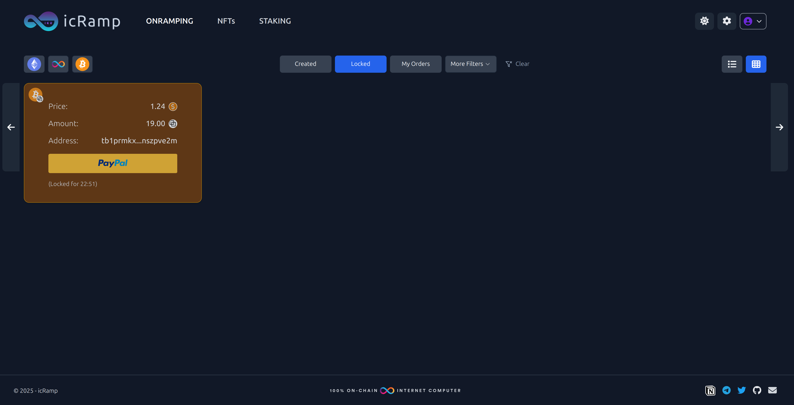
</p>

## Canisters and components

<p align="center" style="margin-top:25px">
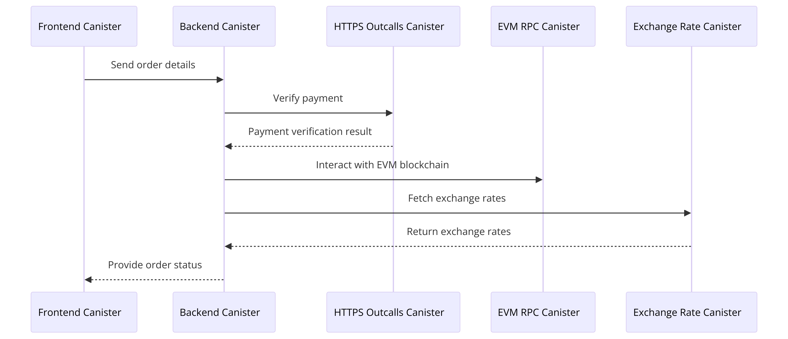
</p>

### Authentication and Login

icRamp supports login and authentication with email, Internet Identity and Ethereum Walets such as Metamask.

<p align="center" style="margin-top:25px">
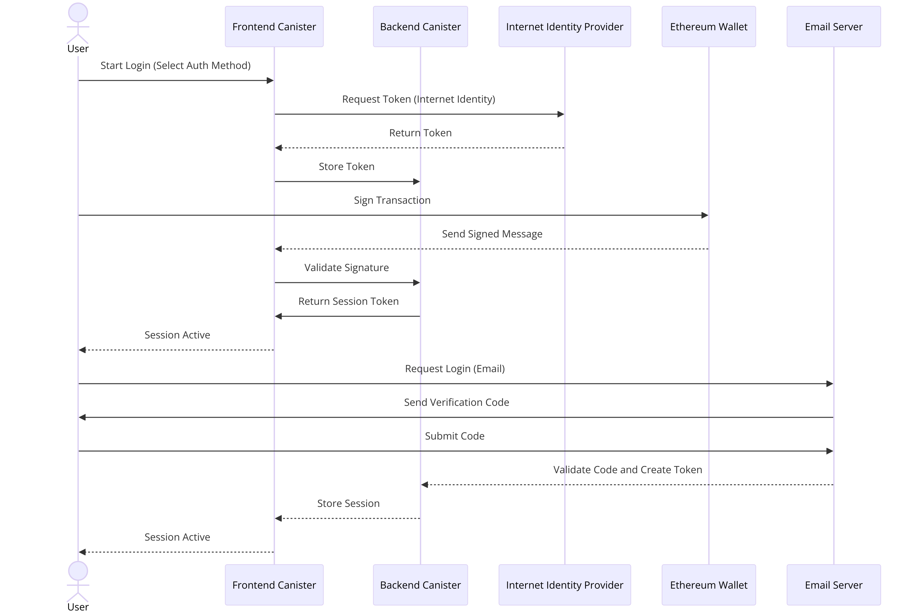
</p>

### HTTPS Outcalls Canister

The HTTPS Outcalls Canister enables secure HTTPS requests from ICP canisters, allowing for external data fetching and API interactions. It is used particularly to fetch order details from the Paypal API in order to verify the transactions.

<p align="center" style="margin-top:25px">
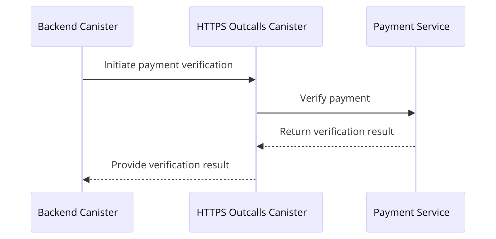
</p>

### EVM RPC Canister

The EVM RPC Canister is a smart contract on the ICP that communicates with Ethereum and other EVM blockchains. It provides an on-chain API for interacting with smart contracts and retrieving blockchain data. It is used to release the funds once the paypal payment is verified.

<p align="center" style="margin-top:25px">
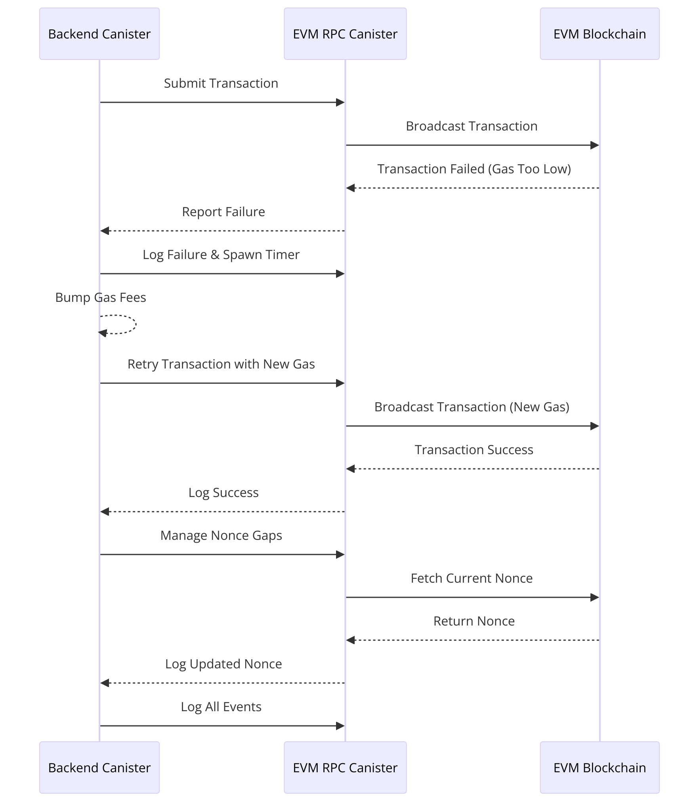
</p>

### Exchange Rate Canister

The Exchange Rate Canister retrieves and provides exchange rates for various assets. It uses an external API to fetch real-time exchange rates and serves this data to other canisters within the protocol. It is used to automatically fetch the best market price for the offramper order.

### Backend Canister

The Backend Canister handles the core business logic of the icRamp protocol. It manages orders, communicates with the EVM RPC canister for blockchain interactions with the escrow in different EVM blockchains, such as Mantle and Polygon, and verifies paypal payments using the HTTPS Outcalls canister.

### Frontend Canister

The Frontend Canister provides a user-friendly interface for interacting with the icRamp protocol. Users can create and manage orders, view exchange rates, make payments and perform other related onramping and offramping operations.

<p align="center" style="margin-top:25px">
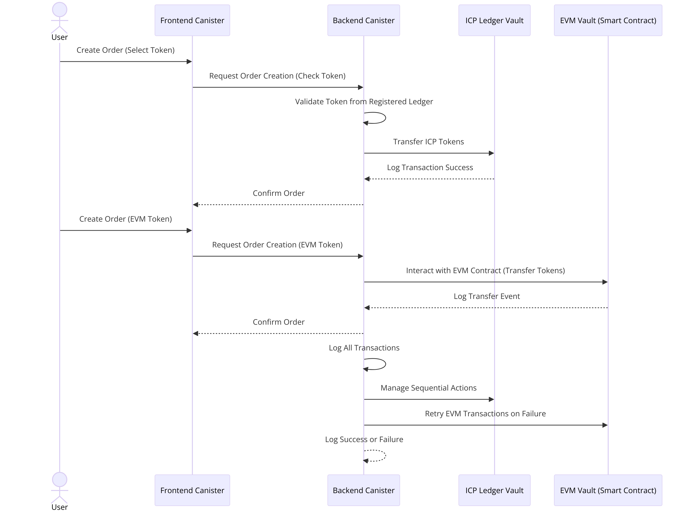
</p>

## How icRamp Supports ICP Adoption

- Multi-Chain Interoperability: Bridges Bitcoin, Ethereum, and ICP.

- Open-Source SDKs & Modules: Provides reusable smart contracts and APIs.

- Educational Content: Blogs, tutorials, and documentation to onboard developers.

## Community Engagement & Future Plans

- Open-source contributions to encourage adoption.

- Workshops and hackathons to showcase icRamp.

- Expanding to Solana and additional fiat onramping solutions.

## 🛠️ Usage

### Build

To build the canisters, use the following command:

```shell
dfx build
```

## Interact

- Call the `get_usd_exchange_rate` method to retrieve the exchange rate for a given asset:

```shell
dfx canister call backend get_usd_exchange_rate '( "ETH" )'
```

- Retrieve and verify a paypal order using the backend canister:

```sh
dfx canister call backend verify_transaction '( "0", transaction_id = "4UC03319AV493141A" )'
```

### Locally:

Run the following commands in a new, empty project directory:

```sh
git clone https://github.com/reymom/ic2P2ramp.git
cd ic2P2ramp
dfx start --clean --background
npm install
npm run setup # Install packages, deploy canisters, and generate type bindings

npm start # Start the development server
```

Also, to deploy seamlessly with prepopulated init arguments:

```sh
./scripts/deploy/deploy_local.sh
```

And for updates, check different argument options in:

```sh
./scripts/update.sh
```

## 📚 Documentation

- [Internet Computer docs](https://internetcomputer.org/docs/current/developer-docs/ic-overview)
- [Internet Computer wiki](https://wiki.internetcomputer.org/)
- [Internet Computer forum](https://forum.dfinity.org/)
- [Vite developer docs](https://vitejs.dev/guide/)
- [React quick start guide](https://react.dev/learn)
- [`dfx.json` reference schema](https://internetcomputer.org/docs/current/references/dfx-json-reference/)
- [Rust developer docs](https://internetcomputer.org/docs/current/developer-docs/backend/rust/)
- [EVM RPC developer docs](https://internetcomputer.org/docs/current/developer-docs/integrations/ethereum/evm-rpc/)
- [Bitcoin developer docs](https://internetcomputer.org/docs/references/bitcoin-how-it-works)
- [Developer Experience Feedback Board](https://dx.internetcomputer.org/)

## License

This project is licensed under the MIT license, see LICENSE.md for details. See CONTRIBUTE.md for details about how to contribute to this project.
